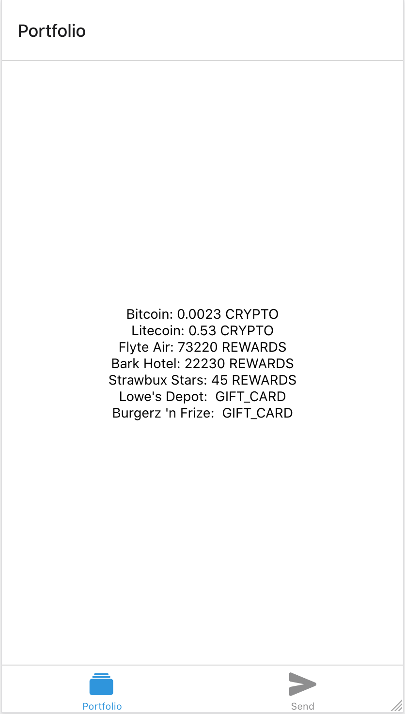

# Bakkt Micro

## About the Repo

This challenge is intended to take between one and two hours. This is Bakkt's React Native technical challenge. It's a very simple, bootstrapped Expo app and lightweight back-end. This app is meant to approximate what the real Bakkt app is like (in tech stack, code, and functionality), but it's boiled down to only the essentials.

It uses:

1. Typescript
1. React Native
1. Expo CLI's basic bootstrapped template (we don't actually use Expo at Bakkt, but it's quicker to set up)
1. [json-graphql-server](https://github.com/marmelab/json-graphql-server) for the back-end, database, and GraphQL
1. [Apollo Client](https://www.apollographql.com/docs/react/) (React client for GraphQL requests)

## Getting Started

1. [Import this repo to your Github account](https://github.com/new/import) **IMPORTANT: Select "Private", not "Public"**
1. Clone your repo locally and `cd` into it
1. Run `yarn` or `npm i`
1. Open a couple of terminal windows.
   1. In the first, run `yarn start`, `yarn ios`, `yarn android`, or `yarn web` (depending on the platform you want to develop on). If you choose web, your app will load up at http://localhost:19006.
   1. In the second, run `yarn serve`. This runs the back-end server, which generates routes and mutations from `db.js`
1. You should now be presented with a very basic app with a portfolio of some holdings of various types.
1. Open the GraphiQL environment for your local server: http://localhost:3000/graphql. You can try queries against the back-end here, with autocomplete.
1. The app will automatically use the light/dark color scheme that your device's OS has set. See [docs here](https://docs.expo.io/versions/latest/sdk/appearance/) to change this, but note that we don't intend to judge based on support for both. Just note which scheme you focused on in your Readme notes below.

## The Challenge

To complete this challenge, pick one of the challenges below:

1. Build out a P2P Send flow, where you can:
   1. Select a holding
   1. Set an amount to send
   1. Find and select a recipient
      - See `users` in `db.js` -- queries for these are available in the back-end (see HoldingsList for an example)
      - Bonus points for filtering by a search field
   1. See an overvievw & submit the transaction (without hooking up to the back-end)
   1. Get a success screen
1. Improve the portfolio page:
   1. Add a pie chart of the holdings
   1. Display all holdings BY CATEGORY, such that each category has its respective holdings' information displayed nicely.
   1. Format all numbers and strings appropriately (denominations, currency symbols, thousands delineation, etc)
   1. Add 'pull to refresh' for updated holdings on the Portfolio page

## What’s important

We will evaluate your submission on:

1. Fulfillment of requirements and functionality
1. Code quality
1. NOT IMPORTANT: Beautiful designs. We're hiring devs, not designers.

In this README (below), please include:

- Your goal and primary focus
- The amount of time you took
- Any assumptions and/or constraints you came up with while working through this challenge
- What you would change or add if you had more time
- A screen recording or screenshots of your app

## Final Product

Push up your repo/branch to Github and give read access to these users: **spsaucier_bakkt**, **qac-87**, **eugene-kolesnik-b**, **lustig-bakkt**, **duncan-iaria**, **KyleJBolton**, and **mahume** and send the URL of your repo to your recruiter or stephen.saucier@bakkt.com.

---
